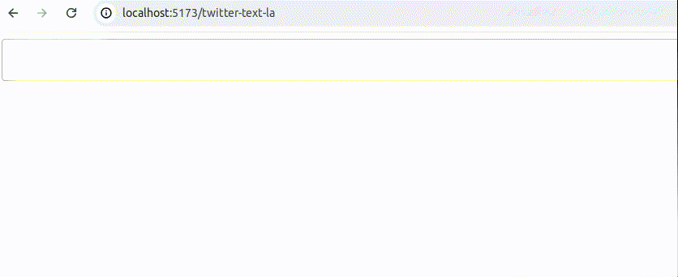

# Twitter-Text-la

Proyecto basado en [tweet-textarea-react](https://github.com/dreamjet31/tweet-textarea-react)

[Demo](https://tcero76.github.io/twitter-text-la/). Área de Texto tipo Twitter, hecho con React+Typescript

# Características:
- [testing](https://github.com/tcero76/twitter-text-la/tree/master/src/tests) Testing hecho con Playwright

- Patrón de diseño Strategy.

- Accesos directos para manipular sugerencias